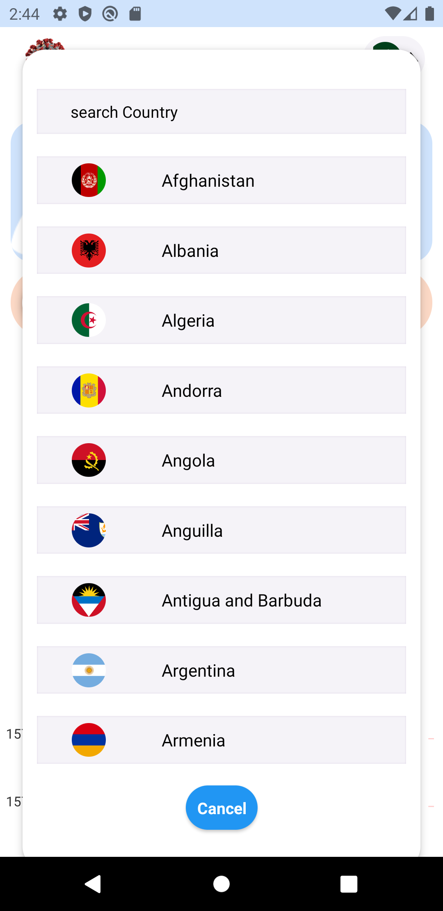
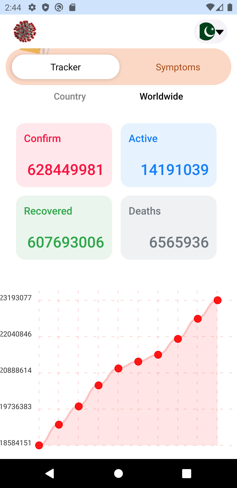

Covid 19 tracker that will track covid reports from all over the world and represent them on graph

<table>
  <tr>
    <td width="23%">
      
    </td>
    <td width="23%">
      
    </td>
    <td width="23%">
      
    </td>
    <td width="23%">
      
    </td>
  </tr>
  <tr>
    <td width="23%">
     <b> Introduction screen</b>
    </td>
    <td width="23%">
      <b>Dashboard with coutry Data</b>
    </td>
    <td width="23%">
      <b>List of Countries</b>
    </td>
    <td width="23%">
      <b>World Wide Covid Records</b>
    </td>
  </tr>
</table>
